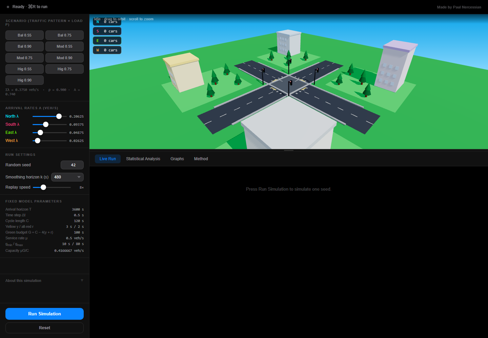
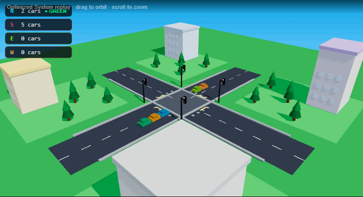
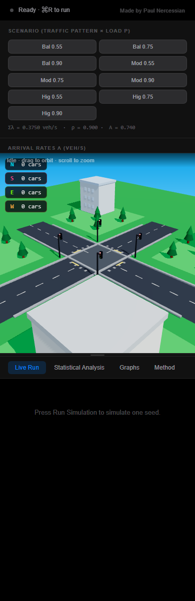

**Live site:** https://bouwles.github.io/Four-Way-Stochastic-Traffic-Simulation/

# Four-Way Stochastic Traffic Simulation

A browser simulation built for my IB Mathematics: Applications and Interpretation Higher Level
Internal Assessment. It models vehicle queues at a four-way intersection and asks a single question:

> Does an adaptive queue-weighted signal policy reduce waiting time compared with an equal-time
> signal plan, and is the difference statistically clear?

Everything runs client-side — there is no backend, no server and no database. Every number, interval
and graph shown in the interface is computed in your browser when you press a button; nothing is
hard-coded, including the selected value of *k*.

---

## Contents

- [The two systems](#the-two-systems)
- [Result snapshot](#result-snapshot)
- [Simulation photos and GIF](#simulation-photos-and-gif)
- [Fixed model parameters](#fixed-model-parameters)
- [Poisson arrivals](#poisson-arrivals)
- [Seeded random numbers](#seeded-random-numbers)
- [Queue evolution](#queue-evolution)
- [Waiting time and fairness](#waiting-time-and-fairness)
- [Traffic load and directional asymmetry](#traffic-load-and-directional-asymmetry)
- [The optimized allocation rule](#the-optimized-allocation-rule)
- [Calibrating k](#calibrating-k)
- [Paired trial design](#paired-trial-design)
- [The nine evaluation scenarios](#the-nine-evaluation-scenarios)
- [Confidence intervals](#confidence-intervals)
- [Time-step sensitivity](#time-step-sensitivity)
- [Graphs](#graphs)
- [CSV exports](#csv-exports)
- [Running it locally](#running-it-locally)
- [Testing](#testing)
- [Deploying to GitHub Pages](#deploying-to-github-pages)
- [Project structure](#project-structure)
- [Limitations](#limitations)
- [Author and citation](#author-and-citation)

---

## The two systems

| Name in the interface | Mathematical name | What it does |
| --- | --- | --- |
| **Equal-Time System** | fixed equal-split plan | Every road receives exactly `G/4 = 25 s` of green in every cycle, whatever the traffic. |
| **Optimized System** | **adaptive queue-weighted policy** | At the start of every complete cycle the same 100 s budget is re-split from the measured queues and the arrival rates. |

Both systems use the same cycle structure, the same service rate and the same green budget. The only
difference is how that budget is divided between the four approaches.

## Result snapshot

The adaptive policy is most useful when demand is uneven. In the full deterministic evaluation, every
scenario uses 250 paired trials: each policy faces the exact same generated arrival times, so the
difference measures the signal rule rather than random traffic luck.

| Demand pattern | Load | Equal-time mean wait | Optimized mean wait | Mean reduction |
| --- | ---: | ---: | ---: | ---: |
| Balanced | 0.55 | 46.9 s | 47.1 s | -0.32% |
| Balanced | 0.90 | 90.5 s | 78.3 s | 12.58% |
| Moderate asymmetry | 0.75 | 230.0 s | 53.4 s | 75.96% |
| High asymmetry | 0.90 | 1104.6 s | 155.7 s | 86.04% |

The balanced low-load case is intentionally included because it is the sanity check: when there is no
meaningful imbalance to exploit, the adaptive policy should not magically win.

## Simulation photos and GIF







## Fixed model parameters

| Symbol | Meaning | Value |
| --- | --- | --- |
| T | Arrival horizon (vehicles stop arriving after this) | 3600 s |
| Δt | Simulation time step | 0.5 s |
| C | Cycle length | 120 s |
| y | Yellow after every green | 3 s |
| r | All-red after every yellow | 2 s |
| μ | Service (saturation flow) rate while green | 0.5 veh/s |
| g<sub>min</sub> | Minimum green per road | 10 s |
| g<sub>max</sub> | Maximum green per road | 80 s |
| G | Usable green budget | `G = C − 4(y + r) = 100 s` |

Roads are always taken in the order **N, S, E, W**. Only one road holds green at a time, and every
green phase is followed by its yellow phase and its all-red phase, which is where the
`4(y + r) = 20 s` of lost time per cycle comes from.

New vehicles stop arriving at `T = 3600 s`, but the signals keep cycling until every queue is empty.
A completed trial therefore always satisfies **total served = total arrivals**, so no delay is hidden
by cutting the run short. A safety limit stops any run that cannot clear and reports an explicit
error rather than looping forever.

## Poisson arrivals

Vehicles arrive on road *i* as a Poisson process of rate λ<sub>i</sub>:

```
P(X = k) = e^(−λt) (λt)^k / k!
```

The process is generated through its exponential interarrival gaps, drawn by inverse CDF:

```
A_i = −ln(1 − U) / λ_i ,   U ~ Uniform[0, 1)
```

Arrival times accumulate until `t ≤ 3600 s`.

## Seeded random numbers

Uniform variates come from a 32-bit linear congruential generator:

```
state = (1664525 × state + 1013904223) mod 2^32
U     = state / 2^32
```

A zero seed is replaced by 1. Each road gets its own deterministic stream by XOR-ing the trial seed
with a fixed offset:

| Road | Offset |
| --- | --- |
| N | `0x1A2B3C` |
| S | `0x4D5E6F` |
| E | `0x7A8B9C` |
| W | `0xDEADBE` |

Trial *j* of a scenario uses `seed = seedBase + j × 31337`, with *j* starting at 0. The same seed
always produces exactly the same arrival arrays, so every result in the application is reproducible.

## Queue evolution

Each road's queue is advanced in discrete steps:

```
Q_i(t + Δt) = max(0, Q_i(t) + A_i(t) − D_i(t))
```

Departures use a **deterministic fractional service accumulator** rather than random rounding of
`μΔt`, so a seed reproduces a run exactly:

```
serviceCredit_i += μΔt
departures       = min(Q_i, floor(serviceCredit_i))        (green only)
```

The credit is reset when a road loses green or when its queue empties, so a fresh green always starts
from zero credit. The queue area is integrated numerically:

```
queueArea_i = Σ Q_i(t) Δt          [vehicle·seconds]
```

## Waiting time and fairness

The headline metric is the **vehicle-weighted mean waiting time**:

```
W = ( Σ_i queueArea_i ) / ( Σ_i N_i )
```

that is, total vehicle-seconds of delay divided by the total number of vehicles. It is deliberately
**not** the average of the four road means W<sub>i</sub>: a road carrying 90 vehicles and a road
carrying 700 should not count equally.

Fairness is the **population** standard deviation of the four road-specific means:

```
F = sqrt[ (1/4) Σ_i (W_i − mean(W_i))² ]
```

A larger F means waiting times are less equal between the roads.

Also reported per run: the mean wait on each road, each road's maximum queue, the overall maximum
queue, total arrivals, total served, the queue-clearance time, the final green allocation, and the
full queue history when it is requested.

## Traffic load and directional asymmetry

```
capacity = μG / C = 0.4166667 veh/s
total λ  = ρ × capacity
```

Three directional demand patterns are used, each multiplied by the total λ:

| Pattern | Shares (N, S, E, W) | A |
| --- | --- | --- |
| Balanced | 0.25, 0.25, 0.25, 0.25 | 0.000 |
| Moderate asymmetry | 0.40, 0.25, 0.20, 0.15 | 0.374 |
| High asymmetry | 0.55, 0.25, 0.13, 0.07 | 0.740 |

where the directional asymmetry is the coefficient of variation of the arrival rates:

```
A = sqrt[ (1/4) Σ_i (λ_i − mean λ)² ] / mean λ
```

## The optimized allocation rule

At the start of every complete cycle the Optimized System measures the four queues and computes

```
w_i = Q_i + k λ_i
g_i = g_min + [ w_i / Σ_j w_j ] (G − 4 g_min)
```

`k` is measured in **seconds**, so `kλ_i` is the number of vehicles expected to arrive on road *i*
during the next `k` seconds. The weight therefore blends the queue that already exists with the
demand that is about to arrive, which stops the split from chasing short-term noise in the queues.

### Iterative bounded allocation

1. Give every road its `g_min = 10 s` minimum.
2. Share the remaining `G − 4g_min = 60 s` in proportion to the four weights.
3. If a road would exceed `g_max = 80 s`, fix it at `g_max`.
4. Redistribute the remaining budget among the roads that are still uncapped.
5. Repeat until the whole budget is allocated.

Every allocation satisfies `10 ≤ g_i ≤ 80` and `Σ g_i = 100`, and this is asserted at runtime — a
violation throws a clear error. Clamping and then rescaling all four values is **not** used, because
rescaling can push a clamped value back outside the bounds. If every weight is zero (for example
`k = 0` on an empty intersection) the split falls back to equal green times.

## Calibrating k

`k` is chosen by a separate calibration mode, on training scenarios that are deliberately disjoint
from the evaluation:

- only `ρ = 0.75`, with the balanced, moderate and high-asymmetry patterns
- 60 paired trials per training scenario
- training seed bases 110000 (balanced), 1110000 (moderate), 2110000 (high) — none of which collide
  with any evaluation seed

For each tested `k`:

```
J(k) = 0.7 · mean(W_O / W_E) + 0.2 · mean(Qmax_O / Qmax_E) + 0.1 · mean(F_O / F_E)
```

Each ratio is formed from the mean performance of a training scenario, and the three scenario ratios
are then averaged. Because every component is a ratio of like quantities the units cancel, so the
three terms can legitimately be added. The tested grid is

```
k ∈ {0, 5, 10, 20, 40, 80, 120, 180, 240, 360, 480, 720, 960, 1440}
```

and the selected `k` is whichever tested value **actually minimises the computed J**. Running
`npm run validate` on this implementation gives:

| k (s) | 240 | 360 | **480** | 720 | 960 |
| --- | --- | --- | --- | --- | --- |
| J(k) | 0.4159 | 0.4140 | **0.4116** | 0.4148 | 0.4182 |

so `k = 480 s` is selected, matching the Internal Assessment's expected minimum (J(480) ≈ 0.4123,
J(720) ≈ 0.4150).

## Paired trial design

Every comparison is **paired**. For each trial the arrival arrays are generated **once** from the
trial seed and the *identical* arrays are handed to both systems. The two systems therefore always
face exactly the same traffic, and the per-trial difference

```
d_j = W_(E,j) − W_(O,j)
```

isolates the effect of the signal policy rather than the luck of the random draw. A positive
`d_j` means the Optimized System performed better on that trial. The percentage reduction is computed
**separately for every trial** and then averaged:

```
r_j = 100 (W_(E,j) − W_(O,j)) / W_(E,j)
```

## The nine evaluation scenarios

250 paired trials each, in this order, with `seedBase = 10,000,000 + i × 1,000,000` for scenario
index *i* starting at 0:

| # | Scenario | Equal W | Optimized W | Mean reduction, 95% CI |
| --- | --- | ---: | ---: | ---: |
| 1 | Balanced, ρ = 0.55 | 46.9 s | 47.1 s | −0.32% [−0.68%, 0.04%] |
| 2 | Balanced, ρ = 0.75 | 56.0 s | 54.2 s | 3.01% [2.61%, 3.42%] |
| 3 | Balanced, ρ = 0.90 | 90.5 s | 78.3 s | 12.58% [11.77%, 13.39%] |
| 4 | Moderate, ρ = 0.55 | 59.9 s | 45.6 s | 21.94% [20.54%, 23.33%] |
| 5 | Moderate, ρ = 0.75 | 230.0 s | 53.4 s | 75.96% [75.39%, 76.53%] |
| 6 | Moderate, ρ = 0.90 | 421.3 s | 91.8 s | 78.25% [77.94%, 78.56%] |
| 7 | High, ρ = 0.55 | 304.5 s | 42.4 s | 85.29% [84.82%, 85.76%] |
| 8 | High, ρ = 0.75 | 747.3 s | 57.8 s | 92.25% [92.17%, 92.33%] |
| 9 | High, ρ = 0.90 | 1104.6 s | 155.7 s | 86.04% [85.79%, 86.28%] |

These are the values this implementation computes, reproduced by `npm run validate`; they are not
stored anywhere in the application. The Equal-Time baseline agrees with the Internal Assessment's
targets to within 0.06%. The Optimized System runs slightly faster than the IA's reference figures in
the most skewed scenarios (up to about 3.7% lower waiting time at high asymmetry, ρ = 0.90), which
traces to how a fractional green phase is rounded onto the Δt grid; the mean reductions still agree
to within 0.54 percentage points and every confidence interval leads to the same conclusion.

Note that scenario 1 is the interesting one: with perfectly balanced demand at a low load there is
nothing for an adaptive policy to exploit, and the interval straddles 0%.

## Confidence intervals

For the paired differences:

```
mean d = Σ d_j / n
s_d    = sqrt[ Σ (d_j − mean d)² / (n − 1) ]          (sample standard deviation)
CI₉₅   = mean d ± t_(0.975, n−1) · s_d / sqrt(n)
```

The critical value is the **Student t** value with `n − 1` degrees of freedom, computed from the t
distribution itself (regularised incomplete beta function plus bisection) rather than assumed to be
1.96. The same construction is applied to the *n* individual percentage reductions `r_j`. The paired
t-statistic and the two-sided p-value come from the same distribution.

Reading the percentage interval:

- entirely **above 0%** → the Optimized System reduced waiting time;
- **containing 0%** → no statistically clear difference;
- entirely **below 0%** → the Optimized System performed worse.

Also reported per scenario: mean maximum queue for each system, mean fairness for each system, and
mean queue-clearance time.

## Time-step sensitivity

High asymmetry at ρ = 0.90, 80 paired trials, `seedBase = 77,000,000` for every time step:

| Δt | Equal W | Optimized W | Reduction |
| --- | ---: | ---: | ---: |
| 1.00 s | 1100.9 s | 152.2 s | 86.28% |
| 0.50 s | 1101.2 s | 156.3 s | 85.91% |
| 0.25 s | 1101.3 s | 159.4 s | 85.63% |

Halving Δt moves the baseline waiting time by less than 0.05%, so the discrete step is fine enough
for the conclusions drawn here.

## Graphs

All five graphs are drawn from computed results, with titles, labelled axes, units, readable category
labels, legends where needed, and a PNG download button:

1. Calibration score **J(k)** against **k**.
2. **Optimized system improvement with 95% paired confidence intervals** — all nine scenarios.
3. Heatmap of mean percentage reduction against traffic load and directional asymmetry.
4. Representative total-queue comparison (seed 42, high asymmetry, ρ = 0.90).
5. Histogram of the paired waiting-time differences `d_j` for high asymmetry, ρ = 0.90.

The live single-run tab additionally plots per-road queues against time for both systems, mean wait
by road, and the green-time allocation.

## CSV exports

| Export | Contents |
| --- | --- |
| Raw paired trials | one row per trial: scenario, ρ, A, k, Δt, all four λ, seed base, trial number, seed, both waiting times, `d_j`, `r_j`, max queues, fairness, clearance times, optimized green split |
| Scenario summaries | one row per scenario: parameters, both means, mean difference and its CI, mean reduction and its CI, t critical value, t statistic, p-value, queues, fairness, clearance, per-road means |
| Calibration results | one row per (k, training scenario): both means for each component, the three ratios, the averaged ratios and J(k) |
| Time-step sensitivity | one row per Δt: both means, reduction and its CI, max queues |
| Representative queue history | one row per sampled step per system: time, all four queues, total queue, active direction, cycle, green split |

Every file carries the scenario parameters, seeds and arrival rates alongside the numbers, so a
downloaded file is self-describing.

## Running it locally

```bash
git clone https://github.com/Bouwles/Four-Way-Stohastic-Traffic-Simulation.git
cd Four-Way-Stohastic-Traffic-Simulation
npm ci
npm run dev        # dev server on http://localhost:5173
```

Other commands:

```bash
npm run build      # production build into dist/
npm run preview    # serve the production build locally
npm run lint       # eslint
npm run capture:media # refresh README screenshots and GIF from the local dev server
```

The heavy analyses (250-trial evaluations, calibration) run inside a **Web Worker**, so the interface
stays responsive and can be cancelled mid-run.

## Testing

```bash
npm test           # node:test suite — no extra dependencies
npm run validate   # full deterministic calibration + evaluation report
```

The test suite covers:

- the LCG reproduces the specified recurrence, and a zero seed becomes 1;
- the directional streams use the required XOR offsets and differ from one another;
- the same seed produces identical arrival arrays;
- both systems in a paired trial receive the same arrays;
- Equal-Time green times are always exactly 25 s;
- optimized green times always total 100 s and always lie in [10, 80], across the whole k grid;
- bounded allocation caps at `g_max` and redistributes instead of rescaling;
- every trial ends with empty queues and `total served = total arrivals`;
- `W` equals the total queue area divided by the total arrivals, and differs from the mean of the
  four road means;
- fairness uses the population standard deviation, not the sample one;
- calibration seeds never collide with evaluation seeds;
- a fixed seed and k give bit-identical results, and a different k does not;
- confidence intervals are built from the paired differences with a t critical value (checked against
  published table values for ν = 1, 9, 29, 60, 249);
- every CSV export contains its full column set with no NaN or infinite values;
- an unclearable demand raises the safety-limit error instead of looping forever;
- the GitHub Pages configuration (base path, `.nojekyll`, workflow) is intact and no backend
  dependency is present.

`npm run validate` additionally runs the real calibration and the full 250-trial evaluation and
prints every computed value next to the Internal Assessment's validation targets, so differences are
visible rather than hidden.

## Deploying to GitHub Pages

Pushing to `main` triggers `.github/workflows/deploy.yml`, which runs `npm ci`, `npm run build` and
publishes `dist/` to the `gh-pages` branch. Two details matter for Pages:

- `vite.config.js` sets `base: '/Four-Way-Stohastic-Traffic-Simulation/'` so the built asset URLs
  resolve under the repository sub-path;
- `public/.nojekyll` stops GitHub from running Jekyll, which would otherwise strip Vite's
  underscore-prefixed asset files.

To deploy manually:

```bash
npm run build
# publish the contents of dist/ to the gh-pages branch
```

## Project structure

```
src/
  model/
    constants.js    fixed parameters, scenarios, capacity, asymmetry, seeds
    rng.js          seeded LCG and the per-direction streams
    arrivals.js     Poisson arrival generation
    policies.js     equal-time split and the bounded queue-weighted allocation
    engine.js       the discrete queue simulation (one implementation, both policies)
    evaluation.js   paired trials, nine-scenario evaluation, calibration, sensitivity
  utils/
    statistics.js   sample/population SD, Student t, paired intervals, p-values
    csvExport.js    CSV builders and the download helper
    chartPng.js     SVG → PNG chart export
  workers/
    analysisWorker.js   runs the analyses off the main thread
  components/     interface: 3D intersection, controls, analysis panel, graphs
tests/            node:test suite
scripts/
  validate.mjs    deterministic validation report
```

There is one simulation implementation; the two systems differ only by the policy passed into it.

## Limitations

This is a **simplified educational simulation written for an IB Mathematics: Applications and
Interpretation HL Internal Assessment. It is not a real traffic-engineering control system**, and the
percentage reductions reported here should not be read as a prediction that a real intersection would
achieve the same improvement.

Assumptions built into the model:

- arrivals are Poisson — independent, memoryless, and at a rate that does not change over the run;
- all vehicles are identical and occupy no physical length;
- the service rate μ is constant for the whole of a green phase;
- there are no turning movements, lane choices or blocked lanes;
- queue storage is unlimited, so spill-back into upstream junctions is not modelled;
- driver reaction and start-up loss are absorbed into μ;
- there are no pedestrian phases, buses, cyclists or emergency vehicles.

Consequences worth stating plainly:

- real arrival rates vary through the day, and real traffic arrives in platoons released by upstream
  signals, both of which break the Poisson independence assumption;
- the policy is given the exact queue length at every cycle boundary; real detectors are noisy and
  may only count vehicles over a short section of road;
- delay is measured as queue area, not as per-vehicle door-to-door travel time;
- because a fractional green phase has to be rounded onto the Δt grid, the Optimized System's
  reported waiting times shift slightly with Δt (see the sensitivity table above);
- the largest improvements occur exactly where the baseline is worst — a heavily oversaturated
  equal-time plan — so they say as much about the weakness of the baseline as about the strength of
  the adaptive policy.

## Author and citation

Created by **Paul Nercessian** for an IB Mathematics: Applications and Interpretation Higher Level
Internal Assessment.

If you refer to this work:

> Nercessian, P. *Four-Way Stochastic Traffic Simulation.*
> https://github.com/Bouwles/Four-Way-Stohastic-Traffic-Simulation
